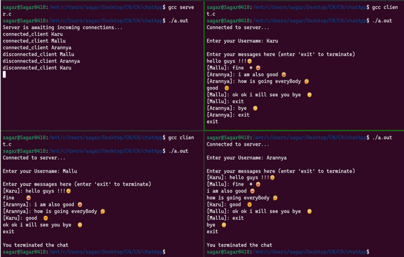

# Multi-Client Group Chat Application

This is a simple multi-client group chat application implemented in C using sockets and pthreads. The application allows multiple clients to connect to a server and engage in a group chat.

## Features

- **Server-Client Architecture**: The application follows a client-server model.
- **Group Chat**: Clients can join a group chat and send messages to all connected clients.
- **Dynamic Client Handling**: New clients can join or leave the chat dynamically.

## Output

Caption: Screenshot of the Multi-Client Group Chat Application in action.

